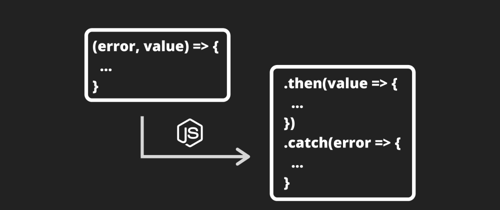

# Curso de Asincronismo con JavaScript

Puedes encontrar alguna de mis notas en [others/](./others/).

El curso se encuentra en: [Platzi](https://platzi.com/clases/asincronismo-js)

## Curso Anterior

[UltiRequiem/ECMAScript6Plus-Platzi](https://github.com/UltiRequiem/ECMAScript6Plus-Platzi)

### LICENSE

[MIT](./LICENSE)
